```mermaid
flowchart LR
  A0["0 features_0<br/>Conv2d"] --> A1["1 features_1<br/>ReLU"] --> A2["2 features_2<br/>MaxPool"]
  A2 --> A3["3 features_3<br/>Conv2d"] --> A4["4 features_4<br/>ReLU"] --> A5["5 features_5<br/>MaxPool"]
  A5 --> A6["6 features_6<br/>Conv2d"] --> A7["7 features_7<br/>ReLU"] --> A8["8 features_8<br/>Conv2d"] --> A9["9 features_9<br/>ReLU"]
  A9 --> A10["10 features_10<br/>Conv2d"] --> A11["11 features_11<br/>ReLU"] --> A12["12 features_12<br/>MaxPool"]
  A12 --> A13["13 avgpool<br/>AdaptiveAvgPool"] --> A14["14 flatten<br/>Reshape"] --> A15["15 classifier_0<br/>Dropout"]
  A15 --> A16["16 classifier_1<br/>Linear"] --> A17["17 classifier_2<br/>ReLU"] --> A18["18 classifier_3<br/>Dropout"]
  A18 --> A19["19 classifier_4<br/>Linear"] --> A20["20 classifier_5<br/>ReLU"] --> A21["21 classifier_6<br/>Linear"]
```

```mermaid
flowchart LR
  R0["0 conv1<br/>Stem Conv"] --> R1["1 bn1<br/>BatchNorm"] --> R2["2 relu<br/>ReLU"] --> R3["3 maxpool<br/>MaxPool"]
  R3 --> R4["4 layer1_0<br/>BasicBlock"] --> R5["5 layer1_1<br/>BasicBlock"]
  R5 --> R6["6 layer2_0<br/>Downsample BasicBlock"] --> R7["7 layer2_1<br/>BasicBlock"]
  R7 --> R8["8 layer3_0<br/>Downsample BasicBlock"] --> R9["9 layer3_1<br/>BasicBlock"]
  R9 --> R10["10 layer4_0<br/>Downsample BasicBlock"] --> R11["11 layer4_1<br/>BasicBlock"]
  R11 --> R12["12 avgpool<br/>GlobalAvgPool"] --> R13["13 flatten_fc<br/>Flatten+FC"]
```

```mermaid
flowchart LR
  M0["0 stem<br/>ConvBNAct"] --> M1["1 IR"] --> M2["2 IR"] --> M3["3 IR"] --> M4["4 IR"]
  M4 --> M5["5 IR"] --> M6["6 IR"] --> M7["7 IR"] --> M8["8 IR"] --> M9["9 IR"]
  M9 --> M10["10 IR"] --> M11["11 IR"] --> M12["12 final ConvBNAct"] --> M13["13 avgpool"]
  M13 --> M14["14 flatten"] --> M15["15 fc"] --> M16["16 hardswish"] --> M17["17 dropout"] --> M18["18 fc"]
```

```mermaid
flowchart LR
  B0["0 patch_class_pos<br/>Patch+CLS+Pos"] --> B1["1 encoder_layer_0<br/>EncoderBlock"] --> B2["2 encoder_layer_1<br/>EncoderBlock"]
  B2 --> B3["3 encoder_layer_2"] --> B4["4 encoder_layer_3"] --> B5["5 encoder_layer_4"] --> B6["6 encoder_layer_5"]
  B6 --> B7["7 encoder_layer_6"] --> B8["8 encoder_layer_7"] --> B9["9 encoder_layer_8"] --> B10["10 encoder_layer_9"]
  B10 --> B11["11 encoder_layer_10"] --> B12["12 encoder_layer_11"] --> B13["13 final_norm_head<br/>Norm+Head"]
```

# major_blocks보다 세밀한 split policy 후보 리포트

작성일: 2026-05-14

대상 모델:

- `alexnet`
- `inception_v3`
- `mobilenet_v3_small`
- `resnet18`
- `vgg19`
- `vit_b_16`
- `vit_l_16`

참조 파일:

- `configs/split_point_policies.json`
- `artifacts/split_configs/<model>/dag_aligned_full.json`

## 사용 가능한 torchvision label

| repo model key | torchvision constructor label | weights enum label | default input | 비고 |
|---|---|---|---|---|
| `alexnet` | `torchvision.models.alexnet` | `AlexNet_Weights` | `1x3x224x224` | sequential CNN |
| `resnet18` | `torchvision.models.resnet18` | `ResNet18_Weights` | `1x3x224x224` | BasicBlock residual CNN |
| `vgg19` | `torchvision.models.vgg19` | `VGG19_Weights` | `1x3x224x224` | sequential Conv/ReLU CNN |
| `vit_b_16` | `torchvision.models.vit_b_16` | `ViT_B_16_Weights` | `1x3x224x224` | 12 encoder blocks |
| `vit_l_16` | `torchvision.models.vit_l_16` | `ViT_L_16_Weights` | `1x3x224x224` | 24 encoder blocks; artifact/cache cost is high |
| `vit` | alias of `torchvision.models.vit_b_16` | `ViT_B_16_Weights` | `1x3x224x224` | repo-local alias |
| `inception_v3` | `torchvision.models.inception_v3` | `Inception_V3_Weights` | `1x3x299x299` | aux logits disabled for single-output chunks |
| `mobilenet_v3_small` | `torchvision.models.mobilenet_v3_small` | `MobileNet_V3_Small_Weights` | `1x3x224x224` | inverted residual + SE blocks |

## 요약

현재 split policy의 boundary index 의미는 `Boundary k = chunk k와 chunk k+1 사이의 split 후보`이다. 따라서 어떤 policy가 `[2, 5]`를 가진다면, `chunk2 -> chunk3` 사이와 `chunk5 -> chunk6` 사이만 split 후보로 활성화한다.

`major_blocks`는 큰 architecture stage 기준으로 잘 동작하지만, profiling/search 관점에서는 후보가 너무 적다. 다만 `all`이나 `ten_points`처럼 개수를 맞추기 위해 임의 boundary를 여는 방식은 적절하지 않다. TensorRT 관점에서는 다음 원칙을 지키는 policy가 더 낫다.

1. `Conv -> ReLU`, `Conv -> BN -> ReLU`, `Linear -> ReLU`처럼 TensorRT가 fusion하거나 같은 tactic 선택 문맥에서 최적화할 수 있는 짧은 producer-consumer pair 내부는 가능하면 split하지 않는다.
2. Residual add, transformer attention, MLP, layer norm, class-token selection처럼 multi-input/multi-output liveness가 얽히는 내부 연산은 현재 artifact가 안전하게 materialize한 wrapper 단위 밖에서만 split한다.
3. Pooling, residual block boundary, transformer encoder block boundary, flatten/head transition처럼 tensor shape나 semantic stage가 바뀌는 지점은 split 후보로 열 수 있다.
4. Eval-mode dropout처럼 실제 inference에서 identity에 가까운 node만 분리하는 boundary는 profiling noise와 candidate 수만 늘릴 가능성이 크므로 기본 후보에서는 제외한다.

이 기준으로 바로 적용 가능한 후보는 다음과 같다.

| model | 추천 후보 이름 | boundary indices | 기존 `major_blocks` 대비 |
|---|---:|---|---|
| `alexnet` | `trt_fusion_safe` | `[1, 2, 4, 5, 7, 9, 11, 14, 17, 20]` | Conv/ReLU pair 단위와 classifier unit 단위까지 세분화 |
| `inception_v3` | `trt_fusion_safe` | `[2, 3, 5, 6, 7, 8, 9, 10, 11, 12, 13, 14, 15, 16, 17, 20]` | BasicConv/Mixed block 내부는 유지하고 block exit 활성화 |
| `mobilenet_v3_small` | `trt_fusion_safe` | `[0, 1, 2, 3, 4, 5, 6, 7, 8, 9, 10, 11, 12, 14, 17]` | InvertedResidual/SE 내부는 유지하고 feature block exit 활성화 |
| `resnet18` | `basicblock_safe` | `[3, 4, 5, 6, 7, 8, 9, 10, 11, 12]` | residual layer 내부의 BasicBlock 사이 boundary 추가 |
| `vgg19` | `trt_fusion_safe` | `[4, 9, 13, 18, 22, 27, 31, 36, 38, 41, 44]` | 4-conv stage midpoint와 classifier unit exit 추가 |
| `vit_b_16` | `trt_fusion_safe` | `[0, 1, 2, 3, 4, 5, 6, 7, 8, 9, 10, 11, 12]` | 12개 encoder block 사이 boundary 전체 활성화 |
| `vit_l_16` | `encoder_block_safe` | `[0, 1, 2, 3, 4, 5, 6, 7, 8, 9, 10, 11, 12, 13, 14, 15, 16, 17, 18, 19, 20, 21, 22, 23, 24]` | 6-layer group 대신 encoder block 단위 boundary 활성화 |

추가로 search 비용을 줄이고 싶다면 `vit_l_16`에는 중간 단계로 `encoder_two_block_safe = [0, 2, 4, 6, 8, 10, 12, 14, 16, 18, 20, 22, 24]`를 둘 수 있다. 이는 transformer block 내부는 유지하면서 두 block 단위로만 split을 허용한다.

## 모델별 policy 3단계 추천

| model | coarse | medium | fine |
|---|---|---|---|
| `alexnet` | `stage = [2,5,12,14]` | `major_blocks = [2,5,7,9,12,14,17,20]` | `trt_fusion_safe = [1,2,4,5,7,9,11,14,17,20]` |
| `resnet18` | `stage = [3,5,7,9,11,12]` | `ten_points = [3,4,5,6,7,8,9,10,11,12]` | `trt_fusion_safe = [3,4,5,6,7,8,9,10,11,12]` |
| `vgg19` | `stage = [4,9,18,27,36,38]` | `major_blocks = [4,9,18,27,36,37,38,41,44]` | `trt_fusion_safe = [4,9,13,18,22,27,31,36,38,41,44]` |
| `vit_b_16` | `major_blocks = [0,4,8,12]` | `ten_points = [0,1,2,3,4,5,6,7,8,9,12]` | `trt_fusion_safe = [0,1,2,3,4,5,6,7,8,9,10,11,12]` |
| `vit_l_16` | `major_blocks = [0,6,12,18,24]` | `trt_fusion_safe = [0,2,4,6,8,10,12,14,16,18,20,22,24]` | `transformer_blocks = [0..24]` |
| `inception_v3` | `stage = [6,9,14,17,20]` | `major_blocks = [6,9,10,14,15,17,20]` | `trt_fusion_safe = [2,3,5,6,7,8,9,10,11,12,13,14,15,16,17,20]` |
| `mobilenet_v3_small` | `stage = [1,3,6,8,11,14,17]` | `major_blocks = [0,1,3,6,8,11,14,17]` | `trt_fusion_safe = [0,1,2,3,4,5,6,7,8,9,10,11,12,14,17]` |

## 현재 artifact의 granular node/chunk

아래 표와 DAG는 `dag_aligned_full.json` 기준이다. 여기서의 chunk가 현재 코드가 안정적으로 mask를 만들고 profiling할 수 있는 최소 단위다.

## AlexNet

현재 chunk 수는 22개이고, 기존 `major_blocks`는 `[2, 5, 7, 9, 12, 14, 17, 20]`이다.

### Node 역할

| id | chunk | role | shape |
|---:|---|---|---|
| 0 | `features_0` | `Conv2d` | `1x3x224x224 -> 1x64x55x55` |
| 1 | `features_1` | `ReLU` | `1x64x55x55 -> 1x64x55x55` |
| 2 | `features_2` | `MaxPool2d` | `1x64x55x55 -> 1x64x27x27` |
| 3 | `features_3` | `Conv2d` | `1x64x27x27 -> 1x192x27x27` |
| 4 | `features_4` | `ReLU` | `1x192x27x27 -> 1x192x27x27` |
| 5 | `features_5` | `MaxPool2d` | `1x192x27x27 -> 1x192x13x13` |
| 6 | `features_6` | `Conv2d` | `1x192x13x13 -> 1x384x13x13` |
| 7 | `features_7` | `ReLU` | `1x384x13x13 -> 1x384x13x13` |
| 8 | `features_8` | `Conv2d` | `1x384x13x13 -> 1x256x13x13` |
| 9 | `features_9` | `ReLU` | `1x256x13x13 -> 1x256x13x13` |
| 10 | `features_10` | `Conv2d` | `1x256x13x13 -> 1x256x13x13` |
| 11 | `features_11` | `ReLU` | `1x256x13x13 -> 1x256x13x13` |
| 12 | `features_12` | `MaxPool2d` | `1x256x13x13 -> 1x256x6x6` |
| 13 | `avgpool` | `AdaptiveAvgPool2d` | `1x256x6x6 -> 1x256x6x6` |
| 14 | `flatten` | `flatten` | `1x256x6x6 -> 1x9216` |
| 15 | `classifier_0` | `Dropout` | `1x9216 -> 1x9216` |
| 16 | `classifier_1` | `Linear` | `1x9216 -> 1x4096` |
| 17 | `classifier_2` | `ReLU` | `1x4096 -> 1x4096` |
| 18 | `classifier_3` | `Dropout` | `1x4096 -> 1x4096` |
| 19 | `classifier_4` | `Linear` | `1x4096 -> 1x4096` |
| 20 | `classifier_5` | `ReLU` | `1x4096 -> 1x4096` |
| 21 | `classifier_6` | `Linear` | `1x4096 -> 1x1000` |

### Granular DAG



### Policy 후보

추천 후보: `trt_fusion_safe = [1, 2, 4, 5, 7, 9, 11, 12, 14, 17, 20]`

근거:

- `Conv -> ReLU` 내부 boundary인 `0, 3, 6, 8, 10`은 비활성화한다. TensorRT가 activation fusion과 tactic 선택을 같은 engine 내부에서 처리할 수 있는 대표적인 구간이다.
- ReLU 뒤 boundary `1, 4, 7, 9, 11`은 conv unit이 끝난 지점이므로 split 후보로 열 수 있다.
- MaxPool 뒤 boundary `2, 5, 12`는 spatial resolution이 바뀌는 stage boundary다.
- `14`는 flatten 뒤 boundary로 tensor rank가 바뀌는 지점이다.
- `17, 20`은 `Linear -> ReLU` classifier unit 종료 지점이다.
- `15, 18`은 eval-mode dropout 주변이라 기본 후보에서 제외한다.
- `13`은 현재 shape가 `6x6 -> 6x6`이라 AlexNet artifact에서는 독립적인 adaptive avgpool split 이득이 작을 가능성이 있어 제외한다.

보수적 대안: `feature_unit_only = [1, 2, 4, 5, 7, 9, 11, 12, 14]`

- classifier 쪽 split이 scheduling search에 과도하게 영향을 주는지 보고 싶을 때 사용한다.

## ResNet18

현재 chunk 수는 14개이고, 기존 `major_blocks`는 `[3, 5, 7, 9, 11, 12]`이다. artifact note에 따르면 BasicBlock 내부 split은 residual add의 multi-value liveness 때문에 아직 wrapper 수준에서 묶여 있다. 따라서 현재 즉시 쓸 수 있는 가장 세밀한 안전 단위는 BasicBlock boundary다.

### Node 역할

| id | chunk | role | shape |
|---:|---|---|---|
| 0 | `conv1` | stem conv | `1x3x224x224 -> 1x64x112x112` |
| 1 | `bn1` | stem batch norm | `1x64x112x112 -> 1x64x112x112` |
| 2 | `relu` | stem activation | `1x64x112x112 -> 1x64x112x112` |
| 3 | `maxpool` | stem maxpool | `1x64x112x112 -> 1x64x56x56` |
| 4 | `layer1_0` | BasicBlock | `1x64x56x56 -> 1x64x56x56` |
| 5 | `layer1_1` | BasicBlock | `1x64x56x56 -> 1x64x56x56` |
| 6 | `layer2_0` | downsample BasicBlock | `1x64x56x56 -> 1x128x28x28` |
| 7 | `layer2_1` | BasicBlock | `1x128x28x28 -> 1x128x28x28` |
| 8 | `layer3_0` | downsample BasicBlock | `1x128x28x28 -> 1x256x14x14` |
| 9 | `layer3_1` | BasicBlock | `1x256x14x14 -> 1x256x14x14` |
| 10 | `layer4_0` | downsample BasicBlock | `1x256x14x14 -> 1x512x7x7` |
| 11 | `layer4_1` | BasicBlock | `1x512x7x7 -> 1x512x7x7` |
| 12 | `avgpool` | global average pool | `1x512x7x7 -> 1x512x1x1` |
| 13 | `flatten_fc` | flatten + linear head | `1x512x1x1 -> 1x1000` |

### Granular DAG



### Policy 후보

추천 후보: `basicblock_safe = [3, 4, 5, 6, 7, 8, 9, 10, 11, 12]`

근거:

- `0, 1, 2`는 stem의 `Conv -> BN -> ReLU -> MaxPool` 내부다. TensorRT에서 Conv/BN folding과 activation fusion 여지가 크므로 split하지 않는다.
- `3`은 stem이 끝나는 boundary다.
- `4, 6, 8, 10`은 기존 `major_blocks`가 닫고 있던 같은 residual layer 내부의 BasicBlock 사이 boundary다. BasicBlock wrapper 자체는 유지되므로 residual add 내부 liveness 문제는 만들지 않는다.
- `5, 7, 9, 11`은 각 residual stage 종료 지점이다.
- `12`는 avgpool 뒤 head 전환 지점이다.

중간 대안: `stage_plus_first_block = [3, 4, 5, 6, 7, 8, 9, 10, 11]`

- avgpool/head split을 빼고 residual block scheduling 차이만 보고 싶을 때 사용한다.

미래 후보: `residual_sublayer_safe`

- `conv1/bn1/relu`, `conv2/bn2`, `downsample`, `add/relu` 같은 BasicBlock 내부 subgraph를 나누려면 multi-input/multi-output FX subgraph extraction과 mask materialization이 추가로 필요하다.
- 현재 artifact note가 명시하듯 이 단계는 아직 안전하게 materialize된 단위가 아니므로 이번 policy 후보에는 넣지 않는 것이 맞다.

## VGG19

현재 chunk 수는 46개이고, 기존 `major_blocks`는 `[4, 9, 18, 27, 36, 37, 38, 41, 44]`이다.

### Node 역할

| id | chunk | role | shape |
|---:|---|---|---|
| 0 | `features_0` | `Conv2d` | `1x3x224x224 -> 1x64x224x224` |
| 1 | `features_1` | `ReLU` | `1x64x224x224 -> 1x64x224x224` |
| 2 | `features_2` | `Conv2d` | `1x64x224x224 -> 1x64x224x224` |
| 3 | `features_3` | `ReLU` | `1x64x224x224 -> 1x64x224x224` |
| 4 | `features_4` | `MaxPool2d` | `1x64x224x224 -> 1x64x112x112` |
| 5 | `features_5` | `Conv2d` | `1x64x112x112 -> 1x128x112x112` |
| 6 | `features_6` | `ReLU` | `1x128x112x112 -> 1x128x112x112` |
| 7 | `features_7` | `Conv2d` | `1x128x112x112 -> 1x128x112x112` |
| 8 | `features_8` | `ReLU` | `1x128x112x112 -> 1x128x112x112` |
| 9 | `features_9` | `MaxPool2d` | `1x128x112x112 -> 1x128x56x56` |
| 10 | `features_10` | `Conv2d` | `1x128x56x56 -> 1x256x56x56` |
| 11 | `features_11` | `ReLU` | `1x256x56x56 -> 1x256x56x56` |
| 12 | `features_12` | `Conv2d` | `1x256x56x56 -> 1x256x56x56` |
| 13 | `features_13` | `ReLU` | `1x256x56x56 -> 1x256x56x56` |
| 14 | `features_14` | `Conv2d` | `1x256x56x56 -> 1x256x56x56` |
| 15 | `features_15` | `ReLU` | `1x256x56x56 -> 1x256x56x56` |
| 16 | `features_16` | `Conv2d` | `1x256x56x56 -> 1x256x56x56` |
| 17 | `features_17` | `ReLU` | `1x256x56x56 -> 1x256x56x56` |
| 18 | `features_18` | `MaxPool2d` | `1x256x56x56 -> 1x256x28x28` |
| 19 | `features_19` | `Conv2d` | `1x256x28x28 -> 1x512x28x28` |
| 20 | `features_20` | `ReLU` | `1x512x28x28 -> 1x512x28x28` |
| 21 | `features_21` | `Conv2d` | `1x512x28x28 -> 1x512x28x28` |
| 22 | `features_22` | `ReLU` | `1x512x28x28 -> 1x512x28x28` |
| 23 | `features_23` | `Conv2d` | `1x512x28x28 -> 1x512x28x28` |
| 24 | `features_24` | `ReLU` | `1x512x28x28 -> 1x512x28x28` |
| 25 | `features_25` | `Conv2d` | `1x512x28x28 -> 1x512x28x28` |
| 26 | `features_26` | `ReLU` | `1x512x28x28 -> 1x512x28x28` |
| 27 | `features_27` | `MaxPool2d` | `1x512x28x28 -> 1x512x14x14` |
| 28 | `features_28` | `Conv2d` | `1x512x14x14 -> 1x512x14x14` |
| 29 | `features_29` | `ReLU` | `1x512x14x14 -> 1x512x14x14` |
| 30 | `features_30` | `Conv2d` | `1x512x14x14 -> 1x512x14x14` |
| 31 | `features_31` | `ReLU` | `1x512x14x14 -> 1x512x14x14` |
| 32 | `features_32` | `Conv2d` | `1x512x14x14 -> 1x512x14x14` |
| 33 | `features_33` | `ReLU` | `1x512x14x14 -> 1x512x14x14` |
| 34 | `features_34` | `Conv2d` | `1x512x14x14 -> 1x512x14x14` |
| 35 | `features_35` | `ReLU` | `1x512x14x14 -> 1x512x14x14` |
| 36 | `features_36` | `MaxPool2d` | `1x512x14x14 -> 1x512x7x7` |
| 37 | `avgpool` | `AdaptiveAvgPool2d` | `1x512x7x7 -> 1x512x7x7` |
| 38 | `flatten` | `flatten` | `1x512x7x7 -> 1x25088` |
| 39 | `classifier_0` | `Linear` | `1x25088 -> 1x4096` |
| 40 | `classifier_1` | `ReLU` | `1x4096 -> 1x4096` |
| 41 | `classifier_2` | `Dropout` | `1x4096 -> 1x4096` |
| 42 | `classifier_3` | `Linear` | `1x4096 -> 1x4096` |
| 43 | `classifier_4` | `ReLU` | `1x4096 -> 1x4096` |
| 44 | `classifier_5` | `Dropout` | `1x4096 -> 1x4096` |
| 45 | `classifier_6` | `Linear` | `1x4096 -> 1x1000` |

### Granular DAG


### Policy 후보

추천 후보: `trt_fusion_safe = [1, 3, 4, 6, 8, 9, 11, 13, 15, 17, 18, 20, 22, 24, 26, 27, 29, 31, 33, 35, 36, 38, 41, 44]`

근거:

- 모든 `Conv -> ReLU` 내부 boundary는 닫는다. 닫히는 boundary는 `0, 2, 5, 7, 10, 12, 14, 16, 19, 21, 23, 25, 28, 30, 32, 34`이다.
- 각 conv unit 종료 지점인 ReLU 뒤 boundary는 연다. 이는 `major_blocks`보다 훨씬 세밀하지만 TensorRT activation fusion을 직접 끊지는 않는다.
- `4, 9, 18, 27, 36`은 VGG feature stage의 MaxPool exit이므로 계속 유지한다.
- `38`은 flatten 이후 classifier로 넘어가는 rank-change boundary라 유지한다.
- classifier에서는 `41, 44`를 유지한다. 현재 기존 `major_blocks`도 dropout 뒤를 unit 종료로 보고 있으므로 호환성이 좋다.
- `37`은 `7x7 -> 7x7` adaptive avgpool이라 VGG19 기준으로는 독립 split 이득이 작고, `38` flatten boundary가 더 명확하다. 따라서 추천 후보에서는 제외한다.

더 공격적인 대안: `paper_like_no_conv_relu = [1, 3, 4, 6, 8, 9, 11, 13, 15, 17, 18, 20, 22, 24, 26, 27, 29, 31, 33, 35, 36, 37, 38, 40, 41, 43, 44]`

- 기존 `paper_like`에 가까운 후보이지만 `Conv -> ReLU` 내부 split은 계속 제외한다.
- avgpool, classifier ReLU 뒤, dropout 뒤를 모두 열어 search 공간을 더 넓힌다.
- profiling 비용이 커지고 identity/dropout 주변 boundary가 섞이므로 기본값보다는 ablation용으로 보는 것이 맞다.

덜 granular한 대안: `stage_midpoint_safe = [4, 9, 13, 18, 22, 27, 31, 36, 38, 41, 44]`

- split point 수는 11개다.
- 모든 `Conv -> ReLU` 내부 boundary는 계속 닫는다.
- `4, 9, 18, 27, 36`은 기존 `major_blocks`와 동일한 five conv-stage MaxPool exit이다.
- VGG19의 3, 4, 5번째 conv stage는 각각 4개의 `Conv-ReLU` unit을 가진다. 이 stage들에서만 중간 지점인 `13`, `22`, `31`을 추가한다.
- 이 중간 지점은 stage 내부의 두 번째 `Conv-ReLU` unit이 끝난 뒤이므로 TensorRT의 activation fusion을 직접 끊지 않는다.
- 첫 두 stage는 conv unit이 2개뿐이므로 내부 midpoint를 만들지 않는다. 여기서 midpoint를 추가하면 사실상 stage를 conv 하나 단위로 자르는 셈이라 `major_blocks` 대비 이득보다 profiling/search 비용 증가가 더 클 수 있다.
- `38`은 flatten 이후 classifier 진입 boundary다.
- `41, 44`는 classifier의 `Linear-ReLU-Dropout` unit 종료 지점이다. eval-mode dropout은 identity에 가깝지만 기존 `major_blocks`와 호환되는 classifier block exit로 볼 수 있다.
- `37`은 avgpool 뒤 boundary인데, VGG19 artifact에서는 `7x7 -> 7x7`이라 shape 변화가 없고 바로 flatten이 뒤따르므로 제외한다.

이 후보는 `major_blocks`의 9개 boundary에서 2개만 늘리는 것이 아니라, feature extractor의 큰 4-conv stage마다 내부 균형점을 하나씩 열어 준다. 따라서 "더 많은 후보를 보려고 임의로 늘렸다"가 아니라 "반복 conv stage의 앞/뒤 절반을 나누되 TensorRT fusion 단위는 보존한다"는 설명이 가능하다.

## InceptionV3

현재 chunk 수는 22개이고, `trt_fusion_safe`는 `[2, 3, 5, 6, 7, 8, 9, 10, 11, 12, 13, 14, 15, 16, 17, 20]`이다. InceptionV3는 parallel branch와 concat이 많은 구조라 Mixed block 내부를 쪼개지 않는 것이 중요하다. `aux_logits=False`로 single-output inference graph만 사용한다.

### Node 역할

| id | chunk | role | shape |
|---:|---|---|---|
| 0 | `Conv2d_1a_3x3` | BasicConv2d | `1x3x299x299 -> 1x32x149x149` |
| 1 | `Conv2d_2a_3x3` | BasicConv2d | `1x32x149x149 -> 1x32x147x147` |
| 2 | `Conv2d_2b_3x3` | BasicConv2d | `1x32x147x147 -> 1x64x147x147` |
| 3 | `maxpool1` | MaxPool2d | `1x64x147x147 -> 1x64x73x73` |
| 4 | `Conv2d_3b_1x1` | BasicConv2d | `1x64x73x73 -> 1x80x73x73` |
| 5 | `Conv2d_4a_3x3` | BasicConv2d | `1x80x73x73 -> 1x192x71x71` |
| 6 | `maxpool2` | MaxPool2d | `1x192x71x71 -> 1x192x35x35` |
| 7 | `Mixed_5b` | InceptionA | `1x192x35x35 -> 1x256x35x35` |
| 8 | `Mixed_5c` | InceptionA | `1x256x35x35 -> 1x288x35x35` |
| 9 | `Mixed_5d` | InceptionA | `1x288x35x35 -> 1x288x35x35` |
| 10 | `Mixed_6a` | InceptionB reduction | `1x288x35x35 -> 1x768x17x17` |
| 11 | `Mixed_6b` | InceptionC | `1x768x17x17 -> 1x768x17x17` |
| 12 | `Mixed_6c` | InceptionC | `1x768x17x17 -> 1x768x17x17` |
| 13 | `Mixed_6d` | InceptionC | `1x768x17x17 -> 1x768x17x17` |
| 14 | `Mixed_6e` | InceptionC | `1x768x17x17 -> 1x768x17x17` |
| 15 | `Mixed_7a` | InceptionD reduction | `1x768x17x17 -> 1x1280x8x8` |
| 16 | `Mixed_7b` | InceptionE | `1x1280x8x8 -> 1x2048x8x8` |
| 17 | `Mixed_7c` | InceptionE | `1x2048x8x8 -> 1x2048x8x8` |
| 18 | `avgpool` | AdaptiveAvgPool2d | `1x2048x8x8 -> 1x2048x1x1` |
| 19 | `dropout` | Dropout | `1x2048x1x1 -> 1x2048x1x1` |
| 20 | `flatten` | flatten | `1x2048x1x1 -> 1x2048` |
| 21 | `fc` | Linear | `1x2048 -> 1x1000` |

### Granular DAG


### Policy 후보

- `stage = [6, 9, 14, 17, 20]`: stem, Inception-A group, Inception-C group, Inception-E group, flatten/head만 split한다.
- `major_blocks = [6, 9, 10, 14, 15, 17, 20]`: stage boundary에 reduction block `Mixed_6a`, `Mixed_7a` 직후를 추가한다.
- `trt_fusion_safe = [2, 3, 5, 6, 7, 8, 9, 10, 11, 12, 13, 14, 15, 16, 17, 20]`: BasicConv2d 내부의 Conv/BN/ReLU와 Mixed block 내부 branch/concat은 유지하고, block output만 split 후보로 연다. `avgpool/dropout` 주변은 identity/reshape 성격이 강해 `20` flatten 뒤 boundary만 유지한다.

## MobileNetV3-Small

현재 chunk 수는 19개이고, `trt_fusion_safe`는 `[0, 1, 2, 3, 4, 5, 6, 7, 8, 9, 10, 11, 12, 14, 17]`이다. MobileNetV3는 depthwise convolution, squeeze-excitation, projection, residual add가 `InvertedResidual` 내부에 묶인다.

### Node 역할

| id | chunk | role | shape |
|---:|---|---|---|
| 0 | `features_0` | stem Conv2dNormActivation | `1x3x224x224 -> 1x16x112x112` |
| 1 | `features_1` | InvertedResidual | `1x16x112x112 -> 1x16x56x56` |
| 2 | `features_2` | InvertedResidual | `1x16x56x56 -> 1x24x28x28` |
| 3 | `features_3` | InvertedResidual | `1x24x28x28 -> 1x24x28x28` |
| 4 | `features_4` | InvertedResidual | `1x24x28x28 -> 1x40x14x14` |
| 5 | `features_5` | InvertedResidual | `1x40x14x14 -> 1x40x14x14` |
| 6 | `features_6` | InvertedResidual | `1x40x14x14 -> 1x40x14x14` |
| 7 | `features_7` | InvertedResidual | `1x40x14x14 -> 1x48x14x14` |
| 8 | `features_8` | InvertedResidual | `1x48x14x14 -> 1x48x14x14` |
| 9 | `features_9` | InvertedResidual | `1x48x14x14 -> 1x96x7x7` |
| 10 | `features_10` | InvertedResidual | `1x96x7x7 -> 1x96x7x7` |
| 11 | `features_11` | InvertedResidual | `1x96x7x7 -> 1x96x7x7` |
| 12 | `features_12` | final Conv2dNormActivation | `1x96x7x7 -> 1x576x7x7` |
| 13 | `avgpool` | AdaptiveAvgPool2d | `1x576x7x7 -> 1x576x1x1` |
| 14 | `flatten` | flatten | `1x576x1x1 -> 1x576` |
| 15 | `classifier_0` | Linear | `1x576 -> 1x1024` |
| 16 | `classifier_1` | Hardswish | `1x1024 -> 1x1024` |
| 17 | `classifier_2` | Dropout | `1x1024 -> 1x1024` |
| 18 | `classifier_3` | Linear | `1x1024 -> 1x1000` |

### Granular DAG



### Policy 후보

- `stage = [1, 3, 6, 8, 11, 14, 17]`: resolution/channel stage exit와 classifier exit만 연다.
- `major_blocks = [0, 1, 3, 6, 8, 11, 14, 17]`: stem exit를 추가해 early downsampling과 feature stages를 분리한다.
- `trt_fusion_safe = [0, 1, 2, 3, 4, 5, 6, 7, 8, 9, 10, 11, 12, 14, 17]`: `InvertedResidual` 내부의 depthwise/SE/projection/residual은 유지하고 block output만 연다. `avgpool -> flatten`은 `14`로 대표하고, classifier의 `Linear -> Hardswish -> Dropout` unit은 `17`에서 끊는다.

## ViT-B-16

현재 chunk 수는 14개이고, `trt_fusion_safe`는 `[0, 1, 2, 3, 4, 5, 6, 7, 8, 9, 10, 11, 12]`이다. ViT-B/16은 encoder block이 12개라 encoder-block boundary 기준으로 열 수 있는 split point는 최대 13개다. 따라서 "약 15개"에 가장 가까우면서 현재 artifact가 안전하게 materialize할 수 있는 후보는 모든 block boundary를 여는 방식이다.

### Node 역할

| id | chunk | role | shape |
|---:|---|---|---|
| 0 | `patch_class_pos` | patch projection + class token + positional embedding | `1x3x224x224 -> 1x197x768` |
| 1 | `encoder_layer_0` | transformer EncoderBlock | `1x197x768 -> 1x197x768` |
| 2 | `encoder_layer_1` | transformer EncoderBlock | `1x197x768 -> 1x197x768` |
| 3 | `encoder_layer_2` | transformer EncoderBlock | `1x197x768 -> 1x197x768` |
| 4 | `encoder_layer_3` | transformer EncoderBlock | `1x197x768 -> 1x197x768` |
| 5 | `encoder_layer_4` | transformer EncoderBlock | `1x197x768 -> 1x197x768` |
| 6 | `encoder_layer_5` | transformer EncoderBlock | `1x197x768 -> 1x197x768` |
| 7 | `encoder_layer_6` | transformer EncoderBlock | `1x197x768 -> 1x197x768` |
| 8 | `encoder_layer_7` | transformer EncoderBlock | `1x197x768 -> 1x197x768` |
| 9 | `encoder_layer_8` | transformer EncoderBlock | `1x197x768 -> 1x197x768` |
| 10 | `encoder_layer_9` | transformer EncoderBlock | `1x197x768 -> 1x197x768` |
| 11 | `encoder_layer_10` | transformer EncoderBlock | `1x197x768 -> 1x197x768` |
| 12 | `encoder_layer_11` | transformer EncoderBlock | `1x197x768 -> 1x197x768` |
| 13 | `final_norm_head` | final norm + class token select + classifier head | `1x197x768 -> 1x1000` |

### Granular DAG



### Policy 후보

추천 후보: `trt_fusion_safe = [0, 1, 2, 3, 4, 5, 6, 7, 8, 9, 10, 11, 12]`

근거:

- ViT-B/16의 현재 `dag_aligned_full`는 patch/class/position prep, 12개 encoder block, final norm/head를 materialized chunk로 둔다.
- encoder block 내부에는 layer norm, attention, residual add, MLP, residual add가 포함되므로 내부 split은 현재 wrapper보다 복잡한 liveness 처리가 필요하다.
- block 사이 boundary는 single tensor handoff이고 shape가 `1x197x768`로 일정해 mask materialization과 profiling이 안정적이다.
- ViT-L/16 대비 hidden size와 encoder block 수가 줄어 artifact/cache 용량 부담이 낮다.
- block-level boundary 13개가 현재 안전한 최대 granularity이며, 10~20개 split point 목표에도 들어간다.

보수적 대안: `major_blocks = [0, 4, 8, 12]`

- patch prep 이후, encoder block 4개 단위, final head 전환만 열어 search 비용을 줄인다.
- `trt_fusion_safe`의 candidate/profile 비용이 여전히 크면 이 대안을 사용한다.

## ViT-L-16

현재 chunk 수는 26개이고, 기존 `major_blocks`는 `[0, 6, 12, 18, 24]`이다. artifact는 patch/class/position prep, 24개 transformer encoder block, final norm/head를 각각 안전 단위로 materialize하고 있다. encoder block 내부에는 layer norm, multi-head self-attention, residual add, MLP, residual add가 포함된다.

### Node 역할

| id | chunk | role | shape |
|---:|---|---|---|
| 0 | `patch_class_pos` | patch projection + class token + positional embedding | `1x3x224x224 -> 1x197x1024` |
| 1 | `encoder_layer_0` | transformer EncoderBlock | `1x197x1024 -> 1x197x1024` |
| 2 | `encoder_layer_1` | transformer EncoderBlock | `1x197x1024 -> 1x197x1024` |
| 3 | `encoder_layer_2` | transformer EncoderBlock | `1x197x1024 -> 1x197x1024` |
| 4 | `encoder_layer_3` | transformer EncoderBlock | `1x197x1024 -> 1x197x1024` |
| 5 | `encoder_layer_4` | transformer EncoderBlock | `1x197x1024 -> 1x197x1024` |
| 6 | `encoder_layer_5` | transformer EncoderBlock | `1x197x1024 -> 1x197x1024` |
| 7 | `encoder_layer_6` | transformer EncoderBlock | `1x197x1024 -> 1x197x1024` |
| 8 | `encoder_layer_7` | transformer EncoderBlock | `1x197x1024 -> 1x197x1024` |
| 9 | `encoder_layer_8` | transformer EncoderBlock | `1x197x1024 -> 1x197x1024` |
| 10 | `encoder_layer_9` | transformer EncoderBlock | `1x197x1024 -> 1x197x1024` |
| 11 | `encoder_layer_10` | transformer EncoderBlock | `1x197x1024 -> 1x197x1024` |
| 12 | `encoder_layer_11` | transformer EncoderBlock | `1x197x1024 -> 1x197x1024` |
| 13 | `encoder_layer_12` | transformer EncoderBlock | `1x197x1024 -> 1x197x1024` |
| 14 | `encoder_layer_13` | transformer EncoderBlock | `1x197x1024 -> 1x197x1024` |
| 15 | `encoder_layer_14` | transformer EncoderBlock | `1x197x1024 -> 1x197x1024` |
| 16 | `encoder_layer_15` | transformer EncoderBlock | `1x197x1024 -> 1x197x1024` |
| 17 | `encoder_layer_16` | transformer EncoderBlock | `1x197x1024 -> 1x197x1024` |
| 18 | `encoder_layer_17` | transformer EncoderBlock | `1x197x1024 -> 1x197x1024` |
| 19 | `encoder_layer_18` | transformer EncoderBlock | `1x197x1024 -> 1x197x1024` |
| 20 | `encoder_layer_19` | transformer EncoderBlock | `1x197x1024 -> 1x197x1024` |
| 21 | `encoder_layer_20` | transformer EncoderBlock | `1x197x1024 -> 1x197x1024` |
| 22 | `encoder_layer_21` | transformer EncoderBlock | `1x197x1024 -> 1x197x1024` |
| 23 | `encoder_layer_22` | transformer EncoderBlock | `1x197x1024 -> 1x197x1024` |
| 24 | `encoder_layer_23` | transformer EncoderBlock | `1x197x1024 -> 1x197x1024` |
| 25 | `final_norm_head` | final norm + class token select + classifier head | `1x197x1024 -> 1x1000` |

### Granular DAG


### Policy 후보

추천 후보: `encoder_block_safe = [0, 1, 2, 3, 4, 5, 6, 7, 8, 9, 10, 11, 12, 13, 14, 15, 16, 17, 18, 19, 20, 21, 22, 23, 24]`

근거:

- 현재 `dag_aligned_full`가 이미 transformer block 내부를 하나의 materialized chunk로 묶고 있다.
- 각 encoder block 내부에는 attention, residual add, MLP, residual add가 있어 내부 split은 shape/liveness와 TRT engine IO가 더 복잡하다.
- block 사이 boundary는 tensor shape가 동일하고 single tensor handoff라 mask materialization과 profiling이 안정적이다.
- `major_blocks`의 6-layer group보다 세밀하지만, attention/MLP 내부 fusion 가능성은 보존한다.

중간 대안: `encoder_two_block_safe = [0, 2, 4, 6, 8, 10, 12, 14, 16, 18, 20, 22, 24]`

- 두 encoder block 단위로 split을 열어 candidate 수를 줄인다.
- block-level temporal locality와 repeated shape를 유지하면서 `major_blocks`보다 충분히 더 granular하다.

미래 후보: `encoder_sublayer_safe`

- 각 encoder block을 `LN+QKV+attention+proj+residual`과 `LN+MLP+residual` 두 sublayer로 나누는 정책이다.
- 이 후보는 이론적으로 attention sublayer와 MLP sublayer의 compute 특성이 달라 scheduling 가치가 있다.
- 그러나 현재 artifact는 EncoderBlock 내부를 하나로 materialize하고 있으므로, 이 후보를 쓰려면 ViT 전용 wrapper와 multi-input residual liveness 처리가 먼저 필요하다.

## 구현 제안

최소 수정으로 진행한다면 `configs/split_point_policies.json`에 새 policy key만 추가하면 된다.

권장 추가안:

```json
{
  "alexnet": {
    "trt_fusion_safe": [1, 2, 4, 5, 7, 9, 11, 14, 17, 20]
  },
  "inception_v3": {
    "trt_fusion_safe": [2, 3, 5, 6, 7, 8, 9, 10, 11, 12, 13, 14, 15, 16, 17, 20]
  },
  "mobilenet_v3_small": {
    "trt_fusion_safe": [0, 1, 2, 3, 4, 5, 6, 7, 8, 9, 10, 11, 12, 14, 17]
  },
  "resnet18": {
    "basicblock_safe": [3, 4, 5, 6, 7, 8, 9, 10, 11, 12]
  },
  "vgg19": {
    "trt_fusion_safe": [1, 3, 4, 6, 8, 9, 11, 13, 15, 17, 18, 20, 22, 24, 26, 27, 29, 31, 33, 35, 36, 38, 41, 44]
  },
  "vit_b_16": {
    "trt_fusion_safe": [0, 1, 2, 3, 4, 5, 6, 7, 8, 9, 10, 11, 12]
  },
  "vit_l_16": {
    "encoder_block_safe": [0, 1, 2, 3, 4, 5, 6, 7, 8, 9, 10, 11, 12, 13, 14, 15, 16, 17, 18, 19, 20, 21, 22, 23, 24],
    "encoder_two_block_safe": [0, 2, 4, 6, 8, 10, 12, 14, 16, 18, 20, 22, 24]
  }
}
```

운영 관점의 기본 추천은 다음 순서다.

1. `resnet18`: `basicblock_safe`
2. `vit_b_16`: `trt_fusion_safe`
3. `inception_v3`: `major_blocks`로 먼저 비용 확인 후, 가능하면 `trt_fusion_safe`
4. `mobilenet_v3_small`: `trt_fusion_safe`
5. `vit_l_16`: artifact/cache 비용이 허용될 때만 `encoder_two_block_safe`로 먼저 비용 확인 후, 가능하면 `encoder_block_safe`
6. `alexnet`, `vgg19`: `trt_fusion_safe`

## 검증 체크리스트

새 policy를 실제 config에 넣기 전 다음을 확인하면 된다.

1. policy boundary index가 각 모델의 `_boundaries` 범위를 넘지 않는지 확인한다.
2. `split_point_policy.py`가 새 policy key를 읽는지 dry-run으로 확인한다.
3. `max-candidates` 증가량을 기존 `major_blocks`와 비교한다.
4. early-stop counter에서 `Candidate mask profiles`가 과도하게 커지면 ViT는 block group 단위, InceptionV3는 `major_blocks`, VGG/AlexNet은 classifier boundary를 줄인 대안을 먼저 사용한다.

## 결론

이번 목적에 가장 맞는 정책은 모델별로 다르게 잡는 것이 낫다. AlexNet/VGG19는 `Conv/ReLU` fusion을 보존하면서 conv unit exit와 pooling/rank-change boundary를 여는 방식이 합리적이다. ResNet18은 residual block 내부를 건드리지 않고 BasicBlock 사이를 여는 것이 현재 artifact 수준에서 가장 안전하다. ViT 계열은 transformer block 내부를 유지하고 encoder block boundary를 여는 방식이 가장 명확한 engineering justification을 가진다. InceptionV3는 branch/concat이 있는 Mixed block 내부를 유지해야 하고, MobileNetV3-Small은 depthwise/SE/projection/residual이 묶인 InvertedResidual 내부를 유지하는 것이 맞다. artifact/cache 용량을 고려하면 기본 실험에는 `vit_l_16`보다 `vit_b_16`을 쓰는 편이 현실적이다.
